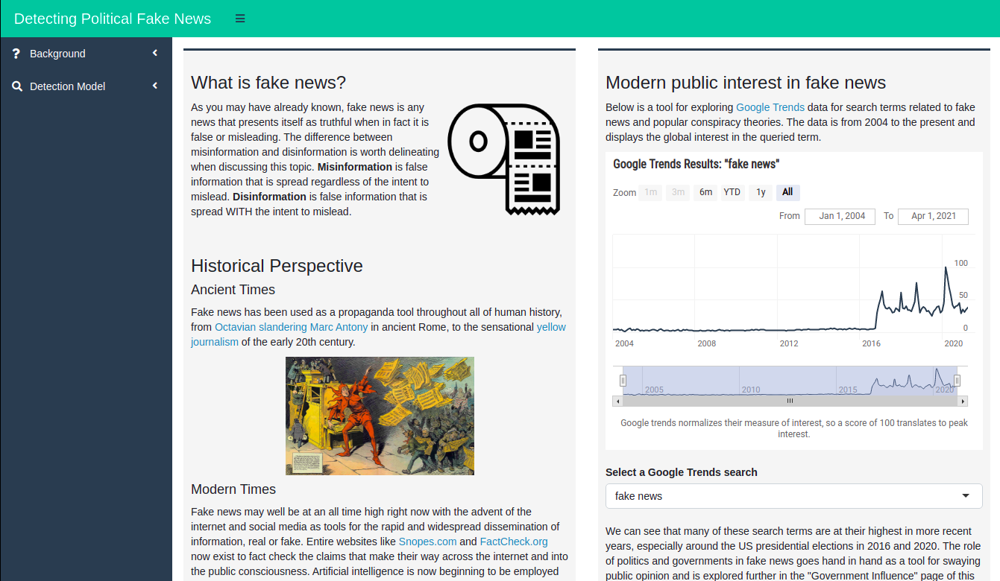

# Detecting Political Fake News - R shiny web app

This project (hosted [here](https://tyler-hill-90.shinyapps.io/detecting-political-fake-news/)) was made as a capstone project for a data visualization class in my MSc program.

It explores the role of fake news in our lives and hosts a predictive NLP model for detecting the credibility of a news article's text.

